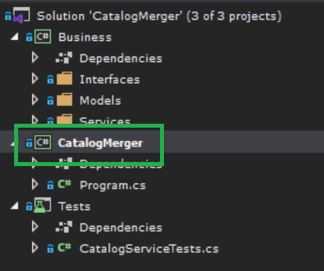
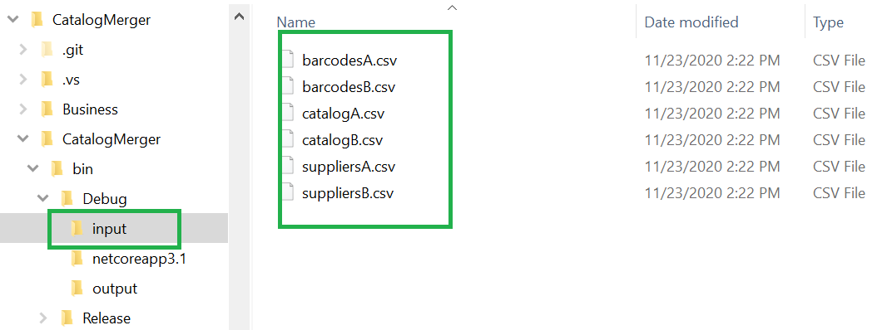
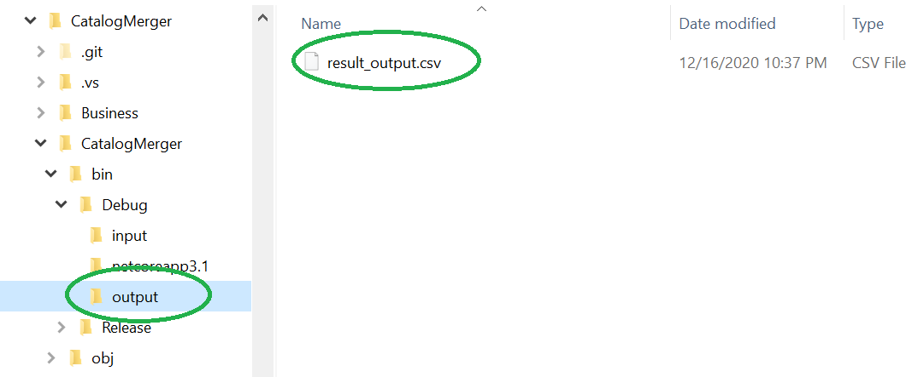
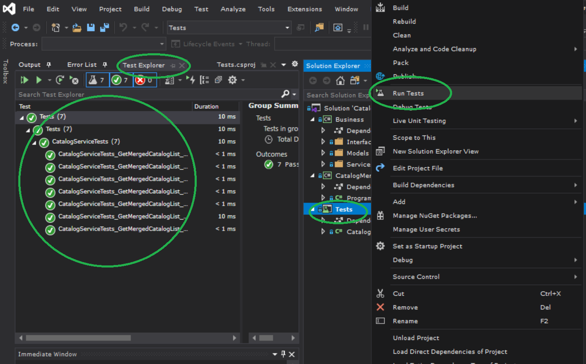

# CatalogMerger

This repo is for coding skill challendge(detail here: https://github.com/tosumitagrawal/codingskills)

### how to run the solution:
- check out the codes
- open solutin using Visual Studio 2019
- build and run "CatalogMerger" project

### input files are located in "..\CatalogMerger\CatalogMerger\bin\Debug\input" folder

### output result file is located in "..\CatalogMerger\CatalogMerger\bin\Debug\output" folder

### how to run the unit tests

